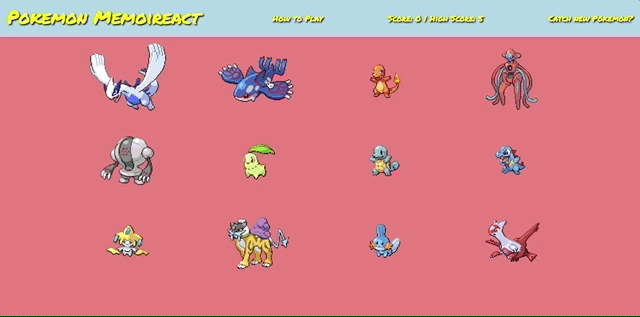

# Pokemon Memoireact

### Technologies Used:
* React.js

### Project Description:
Welcome to Pokemon Memoireact! This game tests your memorization through clicks. Your objective is to click a different Pokemon with every click. With each click,
the Pokemon will shuffle in a random order. If you click a Pokemon that has already been previously clicked, then you lose.

### How to Play:

### How to Catch New Pokemon:

#### Front End
* Landing page layout
    * List View
        * Display title, preview text, author, votes(up and down), category
        * Get Method to grab all posts
* Components
    * Grid
    * Modal
    * Navbar
* Data
    * Static images

#### Back End
* Used Fetch to make API calls to: https://pokeapi.co/api
    * Stored JSON data to state array.

### Future Plans
* Add difficulty levels
* Add different style of plays
  * Filter Pokemon by Type, Evolution, or Rarity